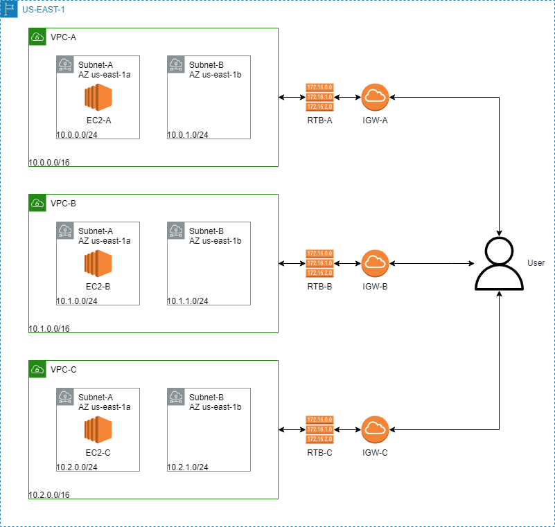

## Aula 02 - Laboratório 01 - Arquitetura Network - Turma 31CLD
Neste laboratório, vamos criar três **VPC** com **sub-redes privadas**. Cada VPC terá sub-redes em
duas **Zonas de Disponibilidade** dentro da Região. Implantaremos uma instância **EC2** por VPC e
demonstraremos que, por padrão, os VPCs fornecem isolamento de rede.
Implantaremos um **Gateway de Internet (IGW)** por VPC. Precisamos de um
Gateway de Internet para estabelecer conectividade externa às instâncias EC2 em VPCs.

## Arquitetura da solução

